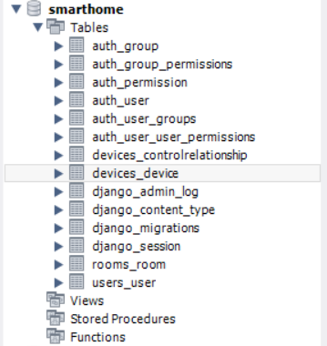
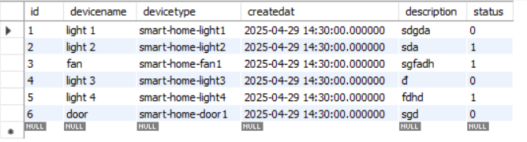
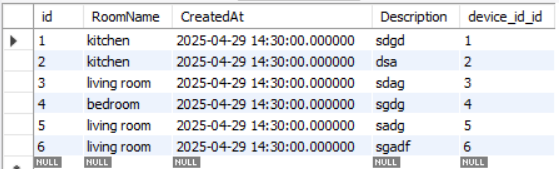

## Table of Contents
- [Overview](#overview)
- [Installation](#installation)
  - [Prerequisites](#prerequisites)
  - [Setting Up the Backend](#setting-up-the-backend)
  - [Setting Up the Frontend](#setting-up-the-frontend)
## Overview

A web application that facilitates the management and control of household devices, incorporating facial recognition technology for primary entrance authentication and voice command functionality to enable device interaction through verbal instructions.

## Installation

### Prerequisites

Before you begin, make sure you have the following installed:
- Python 3.12 or higher - [Download Python](https://www.python.org/downloads/)
- Node.js 16 or higher - [Download Node.js](https://nodejs.org/en/download/)
- npm (included with Node.js) or yarn - [Install Yarn](https://classic.yarnpkg.com/en/docs/install)
- MySQL 
    [For Windows](https://www.geeksforgeeks.org/how-to-install-mysql-in-windows/)
    [For Linux](https://www.geeksforgeeks.org/how-to-install-mysql-on-linux/)
- Adafruit Account with devices setup done
- Google Client ID [Follow the link to create account and get Google Client ID](https://blog.logrocket.com/guide-adding-google-login-react-app/)

### Setting Up the Backend

1. **Clone the repository**
   ```
   git clone https://github.com/yourusername/Smart_Home_Project.git
   cd Smart_Home_Project
   ```

2. **Create and activate a virtual environment**
   ```
   # For Windows
   cd backend
   python -m venv .venv
   .venv\Scripts\activate

   # For macOS/Linux
   cd backend
   python -m venv .venv
   source .venv/bin/activate
   ```

3. **Install dependencies**
   ```
   pip install -r requirements.txt
   ```

4. **Set up environment variables**
   Create a `.env` file in the directory `/backend` with the following:
   ```
   ADAFRUIT_AIO_USERNAME= # Your Adafruit username
   ADAFRUIT_AIO_KEY= # Your Adafruit key
   ADAFRUIT_AIO_FEED_DOOR1=smart-home-door1
   ADAFRUIT_AIO_FEED_FAN1=smart-home-fan1
   ADAFRUIT_AIO_FEED_LIGHT1=smart-home-light1
   ADAFRUIT_AIO_FEED_LIGHT2=smart-home-light2
   ADAFRUIT_AIO_FEED_LIGHT3=smart-home-light3
   ADAFRUIT_AIO_FEED_LIGHT4=smart-home-light4
   MYSQL_USERNAME= # Your MySQL username
   MYSQL_PASSWORD= # Your MySQL password
   MYSQL_DATABASE= # Your MySQL database name
   ```

5. **Set up the database**
   ```
   python manage.py makemigrations devices history rooms users
   python manage.py migrate devices history rooms users
   ```
   - Open MySQL Workbench, you might see the smarthome database like this
    
   - Add the data into devices_device table like this
    
   - Then do the same with rooms_room table
    
6. **Run the backend server**
   ```
   python manage.py runserver
   ```
   The backend will start at http://localhost:8000/

### Setting Up the Frontend

1. **From the project root directory, navigate to the frontend directory**
   ```
   cd frontend
   ```

2. **Install dependencies**
   ```
   # Using npm
   npm install

   # Using yarn
   yarn install
   ```

3. **Create environment file**
   Create a `.env` file in the frontend directory with:
   ```
   REACT_APP_API_URL=http://localhost:8000/api
   REACT_APP_GOOGLE_CLIENT_ID = # Your Goole Client ID
   ```

4. **Start the frontend development server**
   ```
   # Using npm
   npm start

   # Using yarn
   yarn start
   ```